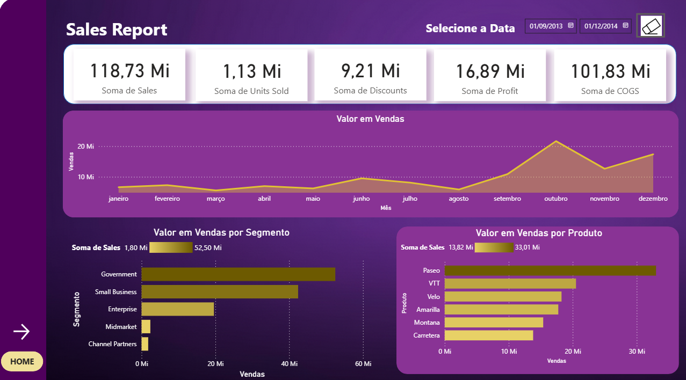
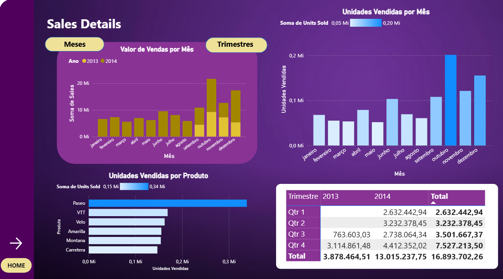
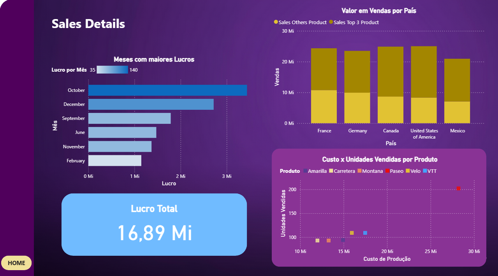

# Projeto: Report Financeiro com Foco em UX (Power BI)

Este projeto transforma um relatório financeiro padrão em uma ferramenta de análise interativa, com foco total na experiência do usuário (UX). O objetivo não é apenas mostrar dados, mas guiar o usuário através deles de forma intuitiva.

---

## 1. O Foco na Experiência (UX)

Cada elemento do design foi pensado para reduzir a carga cognitiva do usuário e facilitar a tomada de decisão.

* Navegação: O relatório possui em 4 páginas com um fluxo lógico que leva o usuário do "macro" (KPIs principais na página "Sales Report") ao "micro" (análises detalhadas de lucro e tempo nas páginas de "Details").

* Hierarquia Visual (UI Design): O design limpo usa contraste e posição para guiar o olhar. Os KPIs mais importantes estão sempre no topo. O tema roxo escuro, com destaques em dourado e azul, é usado estrategicamente para apontar insights-chave (como o produto ou segmento de maior venda), e não apenas para decorar.

* Interatividade Intuitiva: Em vez de filtros complexos, o dashboard "Detailed Sales Report" (página 3) usa botões simples para que o usuário possa alternar a visão de "Meses" para "Trimestres" com um único clique, adaptando o relatório à sua necessidade instantaneamente.

---

## 2. O Desafio Técnico (DAX - Top 3 Produtos)

Um dos principais objetivos analíticos era isolar o impacto dos 3 produtos principais em cada país. Isso provou ser um desafio técnico que exigiu uma fórmula DAX.

Primeiro, foi criada uma medida simples para o total de vendas, que serve como base para todos os outros cálculos.

```dax
Total Sales = SUM(financials[Sales])```

Em seguida, foi criada a medida principal usando CALCULATE para modificar o contexto do filtro. A função TOPN filtra os 3 produtos principais, e KEEPFILTERS é usado para garantir que este novo filtro (Top 3) seja aplicado em conjunto com filtros externos, em vez de sobrescrevê-los.

```dax
Sales Top 3 Product = 
CALCULATE(
    [Total Sales],
    KEEPFILTERS(
        TOPN(
            3,
            ALL(financials[Product]),
            [Total Sales],
            DESC
        )
    )
)```

E então fiz a medida "outros" que subtrai o Top 3 do total, isolando os outros produtos fora do top 3

```dax
Sales Others Product = [Total Sales] - [Sales Top 3 Product]```

---

## 3. Páginas do Relatório

### Página 1: Home


### Página 2: Visão resumida dos principais KPIs, vendas por produto e segmento



### Página 3: Visão detalhada das vendas, com a funcionalidade de Mês/Trimestre



### Página 4: Visão detalhada dos lucros, incluindo o gráfico com a análise Top 3 Produtos por País



---

## 4. Ferramentas Utilizadas

* Power BI Desktop: Para modelagem, criação das medidas DAX, e todo o design de UX e visuais.